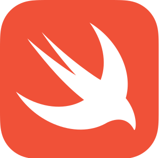

# 👋 Hi there

I am Edoardo, a student from H-Farm and I want to explore WebApp Development, Game Programming & Machine Learning. I am using github to post my projects, make new friends and learn more about programming.
 I mostly enjoy working with python as its syntax is easy and intuitive, which leads me into being more productive on projects and coding problems.
 I also liked to work with C languages to build games and database configuration models. 
  

### 🛠️ Tools and Languages :
 
<html>

&nbsp;&nbsp;&nbsp;
&nbsp;&nbsp;&nbsp;
&nbsp;&nbsp;
&nbsp;&nbsp;&nbsp;
&nbsp;&nbsp;

&nbsp;&nbsp;&nbsp;&nbsp;&nbsp;
&nbsp;&nbsp;&nbsp;
&nbsp;&nbsp;&nbsp;&nbsp;&nbsp;&nbsp;&nbsp;
&nbsp;&nbsp;&nbsp;
&nbsp;&nbsp;
&nbsp;&nbsp;

</html>

 

### 🐙 My Github

&nbsp;&nbsp;&nbsp;&nbsp;&nbsp;&nbsp;&nbsp;&nbsp;

### 🏫 What I am working on ...

- 🔭 I’m currently creating a turn based chess game running on a server.
- 🤔 I’m looking for help with backend programming.
- 📫 How to reach me: edoardo.deirossi@student.h-is.com
- ⚡ Fun fact: I like coding
- 📺 Here is a video for you: <a href="https://www.youtube.com/watch?v=dQw4w9WgXcQ">Explore ></a>
