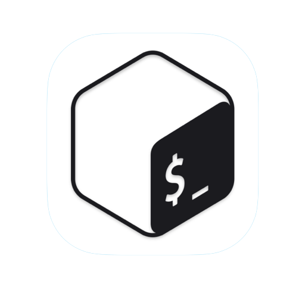

# Hi there 👋

I am a Edoardo DeiRossi, a student from H-Farm and I want to explore Web Development and Machine Learning. I am using github to post my projects, make new friends and learn more about programming. My favourite programming language is python as it is very elastic, dynamically typed and easy to use. It has a huge ecosystem and serves hundreds of inserted libraries and package managers, and can be use for many different projects .
 

<h3>Here are some of the tools I work with :</h3>

<html>

&nbsp;&nbsp;&nbsp;&nbsp;&nbsp;&nbsp;&nbsp;
&nbsp;&nbsp;&nbsp;&nbsp;&nbsp;
&nbsp;&nbsp;&nbsp;&nbsp;

  
&nbsp;&nbsp;&nbsp;
&nbsp;&nbsp;&nbsp;
&nbsp;&nbsp;
&nbsp;&nbsp;&nbsp;
&nbsp;&nbsp;
&nbsp;&nbsp;

  
</html>

<!--
**EdoardoCoding1/EdoardoCoding1** is a ✨ _special_ ✨ repository because its `README.md` (this file) appears on your GitHub profile.

Here are some ideas to get you started:

- 🔭 I’m currently working on ...
- 🌱 I’m currently learning ...
- 👯 I’m looking to collaborate on ...
- 🤔 I’m looking for help with ...
- 💬 Ask me about ...
- 📫 How to reach me: ...
- 😄 Pronouns: ...
- ⚡ Fun fact: ...
-->
